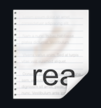
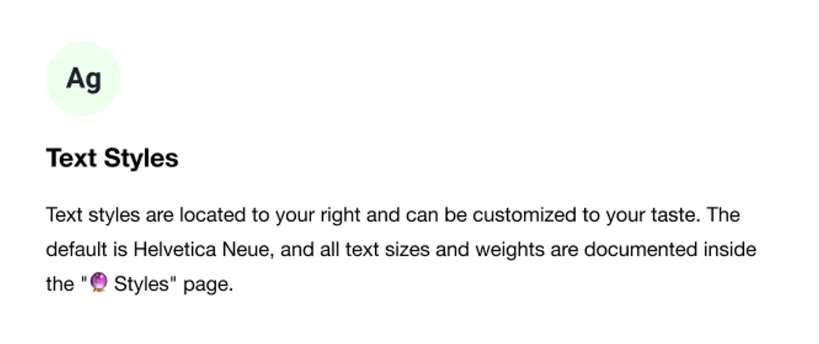
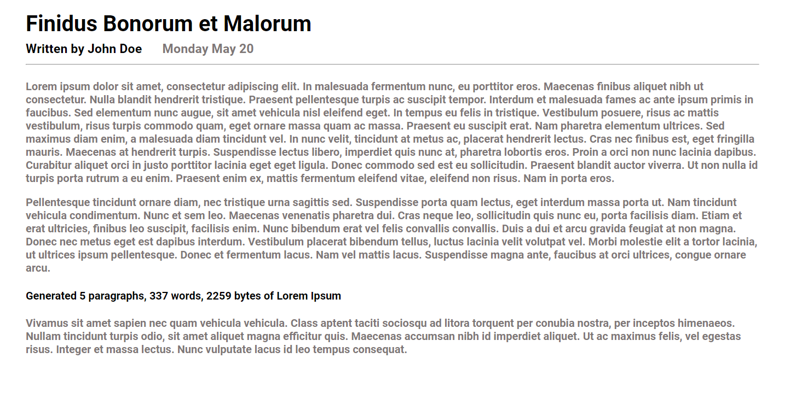
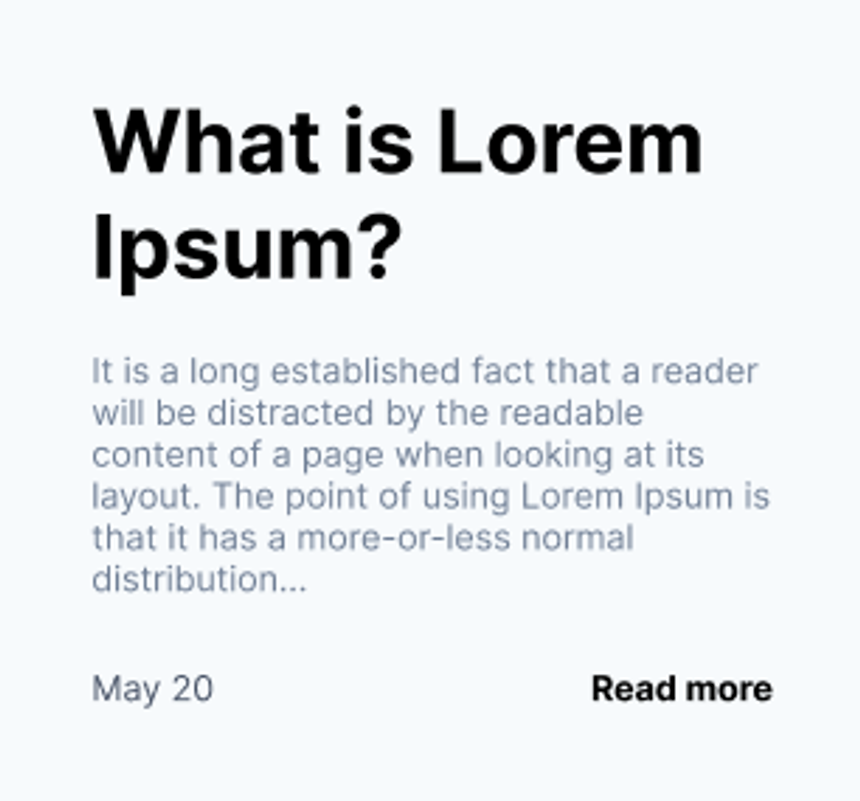
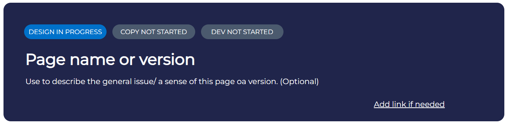
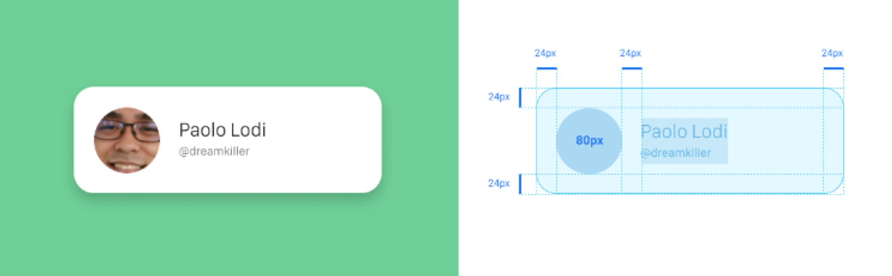
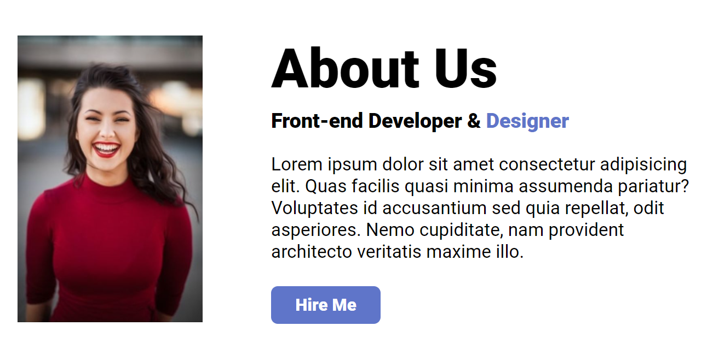
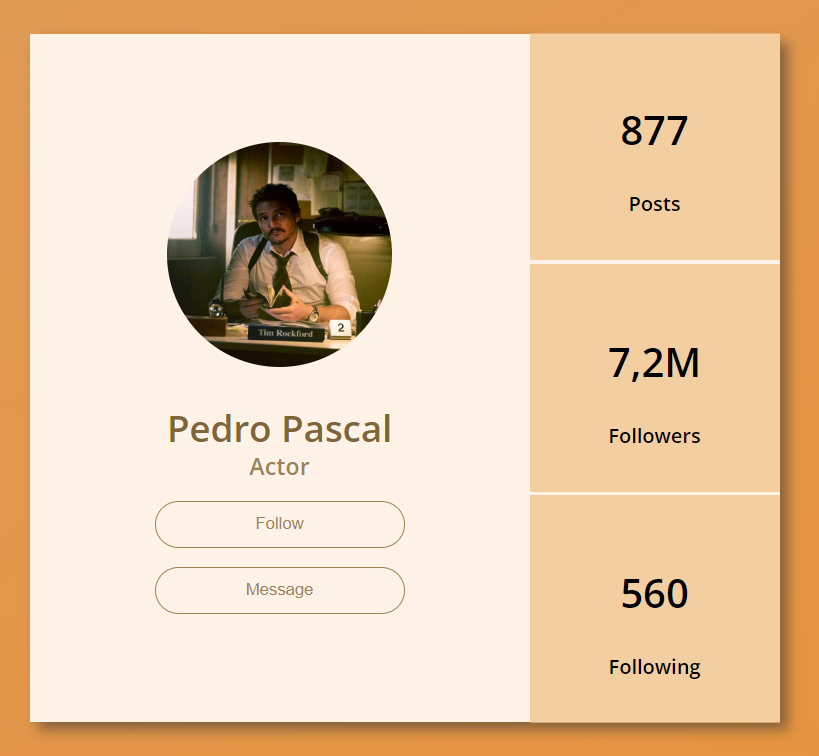
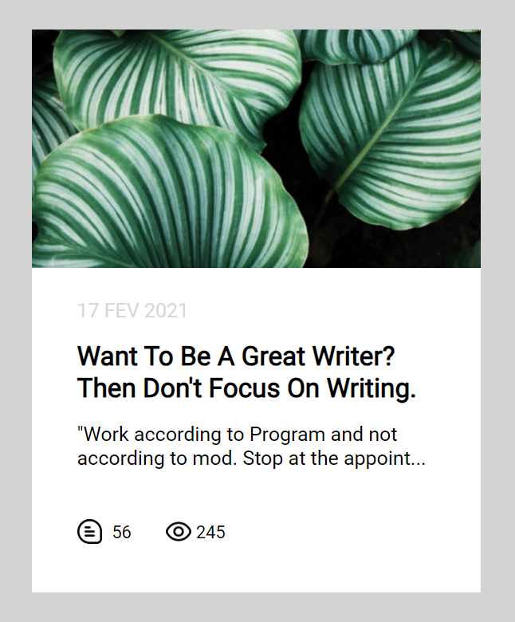

# Задания на верстку

HTML и CSS - это основы веб-разработки. Изучение этих языков позволяет понять, как создаются веб-страницы, как они отображаются в браузере и как взаимодействуют с пользователем.

Задания на HTML и CSS позволяют применить полученные знания на практике. Это помогает лучше понимать, как работают различные элементы и атрибуты, и как они влияют на внешний вид и функциональность веб-страницы.

В приклепленных файлах размещенны примеры готовых версток страниц. Пользователю надо будет самостоятельно повторить или адаптировать шаблон под себя.

Все эти задания помогут новичкам понять, как создавать веб-страницы, и дадут им практический опыт работы с HTML, CSS.

## Необходимые инструменты:

1. Текстовый редактор: Это программа, в которой вы будете писать код. Самые популярные варианты - Visual Studio Code, Sublime Text, Atom, Notepad++.

2. Браузер: Для просмотра результатов работы. Самые популярные - Google Chrome, Mozilla Firefox, Safari.

3. Расширения для браузера: Полезные расширения для браузера, такие как ColorZilla, WhatFont, Wappalyzer, для улучшения работы с веб-страницами.

4. Git: Система контроля версий, которая позволяет отслеживать изменения в коде и работать с несколькими разработчиками.

## Шаблоны готовых заданий:

### Задание 1. Текстовый блок с иконкой

Повторить макет с изображения. Для установки ширины межстрочного интервала используйте свойство line-height

## Задание 2. Публикация для блога

Повторить макет с изображения
Сгенерировать текст в любом генераторе текста-рыбы, например: https://www.lipsum.com/feed/html

## Задание 3. Карточка публикации

Повторить макет с изображения

## Задание 4. Карточка c тегами

## Задание 5. “Простой flexbox”

## Задание 6. Карточка About us

## Задание 7. Карточка пользователя

## Задание 8. Статья

